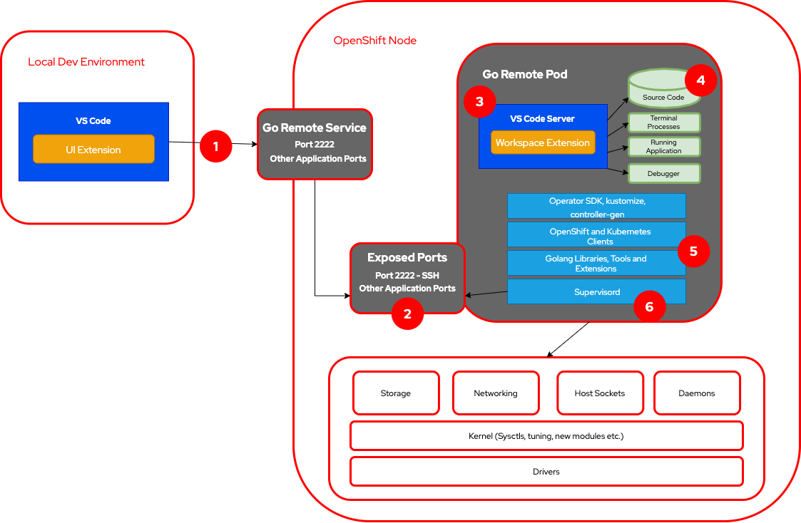

# Go Remote!

A complete containerized Golang development environment to work remotely from within a Kubernetes or OpenShift worker node.

## What is it?

It seems quite easy to develop Kubernetes applications from our laptops when we're just making API calls somewhere on the internet or between our own containers. But what if our application works with special hardware? What if our application needs to retrieve some information that is sitting on the low level layers on the worker node? What if I need to install new drivers on the node? Or tune the kernel some way?

Those tasks are normally performed by Kubernetes operators that have special access permissions on the worker node to make configurations required by also special applications.

But even if we don't need to configure the worker node we may want, for example, to debug a micro service running on the Pod network to troubleshoot specific internal connection related problems or be able to stop the code on certain lines for inspection when its running inside the cluster. It could be testing a new webhook for a specific admission controller. Of course we can expose those ports on our laptops and let that connection happen on the inverse direction from the kubeapi to the webhook we're developing. But wouldn't be cool if I can run the code from the node without installing anything to it?

That's what the go-remote project does. It's basically an operator that allow users to define their development environment as a custom resource and then deploy and serve this dev environment as a VS Code remote server allowing us, developers, to debug, set break points, log points, inspect variables, run our code without compiling it and use the Kubernetes or OpenShift worker nodes as compute resource for that. With that we can mimic behaviors that would only work on the node and also talk to the worker node system directly if we have the proper credentials for that.

## Who is it for?

- Cluster operator developers in need to deal with the worker node directly are the first use case for that.
 

- Developers creating webhooks for admission controllers in need to test them inside the cluster.
 

- Developers of micro-services that are separated from their counter part in the application by network policies and are not exposed externally.
 
 
- Companies that want to host their development environments as a service on Kubernetes and OpenShift clusters with proper security and backup policies. (Future Features)
 

## How does it work?

Here is a high level overview of the go remote development environment and how it works with VS Code:

</img>

  
1. VS Code requires an SSH connection to the remote development environment. Through SSH it can run the VS Code Server and coordinate through extensions the IDE actions or tasks remotely. The SSH port is exposed externally via a Kubernetes service. If you are running Kubernetes or an OpenShift cluster in a Cloud Service Provider it will spin up a service with type LoadBalancer and expose SSH on port 2222. On how to use it instructions you will see how to get the LB url in order to connect your local VS Code to the remote environment.
 
2. The container itself can expose multiple different ports. It will be exposing SSH through port 2222 in order to avoid requesting privileges to bind low number ports. This will be the backend port for the VS Code / Go Remote service. Those ports are exposed through Supervisord that runs inside the Pod. It may be configured to expose multiple different ports for multiple processes/containers in the same Pod. The goal is to be able to mimic any application behavior on the development environment and still have extra ports like the 2222 for remote debugging.
 
3. The VS Code server is the one that does the hard work. It will coordinate the debugging actions on the remote code tree that will be accessed from the Go Remote Pod. If you want to understand better how VS Code remote works check out [here](https://code.visualstudio.com/docs/remote/remote-overview). Please remark that remote container development on VS Code documentation at this point in time is not remote Kubernetes development. It is for running VS Code from a local container running on the developers machine. Not on a cluster worker node.
 
4. The source code, the github project we are working on, is pulled  into the Go Remote container on `go/src/github.com/project/`. And that's the path we need to open remotely in order code, debug and test. It's important to note that both the code on VS Code IDE and the terminals opened from VS Code will be running from the Dev Pod's image and from within the worker node. Any command like `kubectl` or `oc` will reach the kubeapi from within the cluster. Therefore the kubeconfig file also needs to mounted on the Pod. Check the how to configure a dev environment with go-remote operator.
 
5. At this point there is a set of specific packages that are being used for the development container image. But any development image may be built and set on the go-remote operator CR. So if you have a different set of requirements or a ready to go image you only need to change the go-remote image field on the CR pointing it to your registry. One cool future feature is adding the build capability to the go-remote operator. That would allow for updating the packages and requirements automatically.
 
6. Finally Supervisord is the one that allows for multiple processes running inside this Pod and exposing ports as needed giving flexibility to model the service we want the way we want it. "...it is meant to be used to control processes related to a project or a customer, and is meant to start like any other program at boot time." Check http://supervisord.org/

# Get Started

  1 - Deploying the requirements
    oc apply -f manifests/role_binding.yaml
    oc apply -f manifests/role_scc.yaml
    oc apply -f manifests/role.yaml
    oc apply -f manifests/service_account.yaml
    oc apply -f manifests/service.yaml

  2 - Running the operator

    run vscode debugger

  
