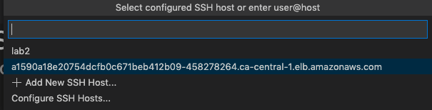

## Deploying Go Remote, your Dev Environment:

Once we have that CR ready we can deploy it like below:

`oc apply -f config/samples/go-remote_v1alpha1_goremote.yaml`

```
goremote.go-remote.opdev.io/goremote-sample created
```

Now we can go to the namespace that we chose for our application and check for that new environment:

`oc get pods -n pod-network-operator`

```
NAME                         READY   STATUS    RESTARTS   AGE
go-remote-6fcbc758fd-mt9tx   1/1     Running   0          71s
```

This first iteration is deploying in OCP on AWS and therefore we need to grab the LB url to ssh into via VS Code into the remote environment. Here it goes:

`oc get svc`

```
NAME            TYPE           CLUSTER-IP     EXTERNAL-IP                                                                 PORT(S)                         AGE
go-remote-svc   LoadBalancer   172.30.17.68   a1590a18e20754dcfb0c671beb412b09-458278264.ca-central-1.elb.amazonaws.com   2222:31175/TCP,2345:31261/TCP   3m16s
```

Finally we may register that URL on our ssh configuration for VS Code to use it.

First hit `F1` in your keyboard and on the command pallette type ssh:

</img>

Click where it says `Connect to Host...` and you should see the following:

</img>

You may add the new ELB address to your configuration file by clicking `Configure SSH Hosts...`

At that moment you should see the configuration file options:

</img>

The file you are looking for is normally under your home folder on .ssh/config.

Add that new host, the ELB, at the end of that file like below:

```
Host  a1590a18e20754dcfb0c671beb412b09-458278264.ca-central-1.elb.amazonaws.com  
  HostName  a1590a18e20754dcfb0c671beb412b09-458278264.ca-central-1.elb.amazonaws.com   
  Port 2222
  User root
```
Of course, replace the URL with your Load Balancer's URL.

Finally it becomes easy to just open again the SSH option and click on the recently added address:

</img>

After clicking `Connect to Host` you should can choose the host you just added:
</img>

Select it and click it.

The connection will initiate. The first step will ask if you want to continue even the host being unknown. Click `Continue` That will save its key to the known hosts file.

</img>

Finally it will ask for a password. Which for this first PoC it's hard coded and is `go1234` for root user on that container.

After the authentication is done we can see that it's connected to the dev container by looking at left bottom corner:

</img>

Click on `open folder` and put the application path after that:

</img>

</img>

And there we Go! The remote environment is now available to be used on your local VS Code instance.

</img>